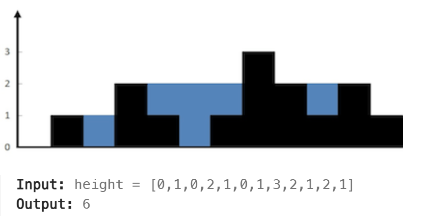

# 单调栈 - 序

[TOC]

### [42. Trapping Rain Water](https://leetcode.cn/problems/trapping-rain-water/)



```python
# 记录左右（包括自己的）最大值
class Solution:
    def trap(self, height: List[int]) -> int:
        leftMax = [height[0]]
        rightMax = [height[-1]]
        for i in range(1, len(height)):
            leftMax.append(max(leftMax[-1], height[i]))
        for i in range(len(height) - 2, -1, -1):
            rightMax.append(max(rightMax[-1], height[i]))
        rightMax.reverse()
        res = 0
        for i in range(len(height)):
            res += min(leftMax[i], rightMax[i]) - height[i]
        return res

# 单调递减栈，如果来了个大的，则形成雨水，pop
class Solution:
    def trap(self, height: List[int]) -> int:
        s = [0]
        res = 0
        for i in range(1, len(height)):
            while len(s) and height[s[-1]] <= height[i]:
                topIdx = s.pop()
                if len(s):
                    res += (min(height[s[-1]], height[i]) - height[topIdx]) * (i - s[-1] - 1)
            s.append(i)
        return res

# 双指针，更新包括自己的leftMax, rightMax，移动小者
class Solution:
    def trap(self, height: List[int]) -> int:
        i, j = 0, len(height) - 1
        leftMax, rightMax = 0, 0
        res = 0
        while i <= j:
            leftMax = max(leftMax, height[i])
            rightMax = max(rightMax, height[j])
            if leftMax >= rightMax:
                res += rightMax - height[j]
                j -= 1
            else:
                res += leftMax - height[i]
                i += 1
        return res
```


### [84. Largest Rectangle in Histogram](https://leetcode.cn/problems/largest-rectangle-in-histogram/)


```python
class Solution:
    def largestRectangleArea(self, heights: List[int]) -> int:
        # 想知道，左边第一个比我小的数，右边第一个比我小的数
        n = len(heights)
        leftIdx = [-1] * n
        rightIdx = [n] * n

        s = []
        for i in range(n):
            while s and heights[s[-1]] >= heights[i]:
                s.pop()
            leftIdx[i] = s[-1] if s else -1
            s.append(i)

        s = []
        for i in range(n - 1, -1, -1):
            while s and heights[s[-1]] >= heights[i]:
                s.pop()
            rightIdx[i] = s[-1] if s else n
            s.append(i)
        
        res =  0
        for i in range(n):
            tmp = (rightIdx[i] - leftIdx[i] - 1) * heights[i]
            res = max(res, tmp)
        return res
 
class Solution:
    def largestRectangleArea(self, heights: List[int]) -> int:
        # 想知道，左边第一个比我小的数，右边第一个比我小的数
        n = len(heights)
        leftIdx = [-1] * n # left nearest < me
        rightIdx = [n] * n # right nearest <= me (考虑 xxxx, 只有最后一个柱子正确求出了右边界. -1, n)
        s = [] # mono increase
        for i in range(n):
            while s and heights[s[-1]] >= heights[i]:
                top = s.pop()
                rightIdx[top] = i
            leftIdx[i] = s[-1] if s else -1
            s.append(i)
        ans = 0
        for i in range(n):
            tmp = (rightIdx[i] - leftIdx[i] - 1) * heights[i]
            ans = max(ans, tmp)
        return ans
```

### [503. Next Greater Element II](https://leetcode.cn/problems/next-greater-element-ii/)

循环数组中，下一个大于自己的数字

```c++
class Solution {
public:
    vector<int> nextGreaterElements(vector<int>& nums) {
        int n = nums.size();
        vector<int> res(n, -1);
        stack<int> s;
        for (int i = 0; i < n * 2 - 1; ++i) {
            while (!s.empty() && nums[s.top()] < nums[i % n]) {
                res[s.top()] = nums[i % n];
                s.pop();
            }
            s.push(i % n);
        }
        return res;
    }
};
```

### [581. Shortest Unsorted Continuous Subarray](https://leetcode.cn/problems/shortest-unsorted-continuous-subarray/)

Given an integer array `nums`, you need to find one **continuous subarray** such that if you only sort this subarray in non-decreasing order, then the whole array will be sorted in non-decreasing order.

**Example 1:**

```
Input: nums = [2,6,4,8,10,9,15]
Output: 5
Explanation: You need to sort [6, 4, 8, 10, 9] in ascending order to make the whole array sorted in ascending order.
```

```python
class Solution:
    def findUnsortedSubarray(self, nums: List[int]) -> int:
        # leftmost time to break inc
        # i.e. exists a number right to me but smaller than me
        # i.e. < rightMin
        leftIdx = -1
        rMin = float('inf')
        for i in range(len(nums) - 1, -1, -1):
            if nums[i] > rMin:
                leftIdx = i
            else:
                rMin = nums[i]
        if leftIdx == -1:
            return 0
        # rightmost time to break inc
        # i.e. me < leftMax
        rightIdx = -1
        leftMax = float('-inf')
        for i in range(len(nums)):
            if nums[i] < leftMax:
                rightIdx = i
            else:
                leftMax = nums[i]
        return rightIdx - leftIdx + 1
```


